# AWS Three-Tier Application Architecture

A production-style three-tier web application deployed on AWS in the **Mumbai (`ap-south-1`) region**, using a custom domain, HTTPS, private application servers, private RDS, Auto Scaling, monitoring, and S3 data-management features.

## 🏗️ Architecture

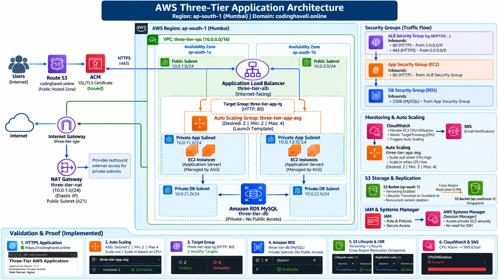

### Traffic Flow

```text
Internet
   │
   ▼
Route 53
   │
   ▼
ACM SSL/TLS
   │
   ▼
Internet-facing ALB
   │
   ▼
Target Group
   │
   ├───────────────┐
   ▼               ▼
Private App AZ1   Private App AZ2
EC2 / ASG         EC2 / ASG
   │               │
   └───────┬───────┘
           ▼
      Amazon RDS
      Private DB Tier
```

Private application instances use the NAT Gateway for required outbound Internet access. The database remains private with no public access.

---

## 🎯 Project Objectives

- Design a highly available AWS VPC across two Availability Zones.
- Separate public, application, and database tiers.
- Deploy application servers in private subnets.
- Provide public access through an Application Load Balancer.
- Configure HTTPS using AWS Certificate Manager.
- Use Auto Scaling for application-server high availability and elasticity.
- Use Amazon RDS MySQL as the private database tier.
- Implement monitoring and email alerting with CloudWatch and SNS.
- Configure S3 versioning, lifecycle management, and Cross-Region Replication.
- Practice AWS CLI and Systems Manager Session Manager.
- Document the implementation and troubleshooting process.

---

## ☁️ AWS Services Used

| Service | Purpose |
|---|---|
| Amazon VPC | Isolated network architecture |
| Internet Gateway | Internet connectivity for public resources |
| NAT Gateway | Outbound Internet access from private app subnets |
| EC2 | Application/web servers |
| Launch Template | Standardized EC2 configuration |
| Auto Scaling Group | High availability and automatic scaling |
| Application Load Balancer | Public traffic distribution |
| Target Group | Health checks and backend registration |
| Amazon RDS MySQL | Managed private database |
| Route 53 | DNS for `codinghaveli.online` |
| AWS Certificate Manager | SSL/TLS certificate |
| CloudWatch | Monitoring and Auto Scaling metrics |
| Amazon SNS | Email notifications |
| Amazon S3 | Object storage |
| S3 Lifecycle | Storage-cost optimization |
| S3 Cross-Region Replication | Disaster-recovery/data-replication practice |
| IAM | Access control |
| Systems Manager | Secure EC2 access without SSH |
| AWS CLI | Command-line administration |

---

## 🌐 Network Architecture

### VPC

- **VPC:** `three-tier-vpc`
- **CIDR:** `10.0.0.0/16`
- **Region:** `ap-south-1` (Mumbai)
- **Availability Zones:** `ap-south-1a`, `ap-south-1b`

### Subnets

| Tier | AZ1 | AZ2 |
|---|---|---|
| Public | `10.0.1.0/24` | `10.0.2.0/24` |
| Private Application | `10.0.11.0/24` | `10.0.12.0/24` |
| Private Database | `10.0.21.0/24` | `10.0.22.0/24` |

### Routing

- Public route table → Internet Gateway
- Private application route table → NAT Gateway
- Private database route table → local VPC routing only

---

## 🔐 Security Design

Three security groups were implemented using a tiered trust model:

```text
Internet
   │
   ▼
ALB Security Group
   │ HTTP/HTTPS
   ▼
App Security Group
   │ MySQL 3306
   ▼
DB Security Group
```

### Security Group Rules

- **ALB SG:** HTTP 80 / HTTPS 443 from the Internet.
- **App SG:** HTTP 80 only from the ALB security group.
- **DB SG:** MySQL 3306 only from the application security group.
- Application EC2 instances do not require public IP addresses.
- Private EC2 access was performed through Systems Manager Session Manager rather than SSH.

---

## ⚖️ Application Load Balancer

**Load Balancer:** `three-tier-alb`

- Internet-facing
- IPv4
- Deployed across two public subnets
- HTTP listener on port 80
- HTTPS listener on port 443
- Forwards requests to `three-tier-app-tg`

### Target Group

**Target Group:** `three-tier-app-tg`

- Target type: EC2 instances
- Protocol: HTTP
- Port: 80
- Health check path: `/health.html`
- Tested with **2 healthy targets**

---

## 📈 Auto Scaling

**Auto Scaling Group:** `three-tier-app-asg`

| Setting | Value |
|---|---:|
| Desired capacity | 2 |
| Minimum | 2 |
| Maximum | 4 |
| Availability Zones | 2 |
| Scaling policy | Target tracking |
| CPU target | 50% |

### Scaling Tests

The Auto Scaling Group was tested under CPU load.

- Scale-out: **2 → 3 instances**
- Scale-in: **3 → 2 instances**
- Instance failure/self-healing was also tested; an unhealthy/terminated instance was replaced automatically.

This demonstrates both **elasticity** and **self-healing**.

---

## 🗄️ Amazon RDS

**Database:** `three-tier-db`

- Engine: MySQL
- Private DB subnets
- Multi-AZ subnet group using two database subnets
- Public access: **Disabled**
- Port: `3306`

Database testing included:

- Database creation
- Table creation
- INSERT
- SELECT
- UPDATE
- DELETE

---

## 🌍 Route 53 + HTTPS

**Domain:** `codinghaveli.online`

DNS was configured using a Route 53 public hosted zone with an Alias record pointing to the Application Load Balancer.

AWS Certificate Manager provided the public SSL/TLS certificate.

Final application URL:

**https://codinghaveli.online**

---

## 🔔 Monitoring and Alerting

CloudWatch was used to monitor CPU utilization and Auto Scaling behavior.

SNS was configured for email notifications.

Monitoring flow:

```text
EC2 / ASG
   │
   ▼
CloudWatch
   │
   ▼
Alarm
   │
   ▼
SNS
   │
   ▼
Email Notification
```

CPU stress testing was performed to validate the monitoring/scaling workflow.

---

## 🪣 Amazon S3

The S3 practical included:

### Versioning

Bucket versioning was enabled and multiple versions of an object were tested.

### Lifecycle

A lifecycle rule was configured to:

- Transition current objects to **S3 Standard-IA after 30 days**
- Permanently delete noncurrent versions after **90 days**

### Cross-Region Replication

Objects were replicated from the Mumbai source bucket to a destination bucket in **Singapore (`ap-southeast-1`)**.

```text
Mumbai S3 Bucket
       │
       │ Cross-Region Replication
       ▼
Singapore S3 Bucket
```

---

## 💻 AWS CLI

AWS CLI was configured and tested for:

```bash
aws sts get-caller-identity
aws s3 ls
aws s3 cp cli-test.txt s3://<bucket-name>/
aws s3 cp s3://<bucket-name>/cli-test.txt downloaded-cli-test.txt
aws ec2 describe-instances
aws ec2 describe-vpcs
aws ec2 describe-security-groups
```

No AWS credentials or secrets are stored in this repository.

---

## 🧪 Validation & Evidence

### VPC Resource Map
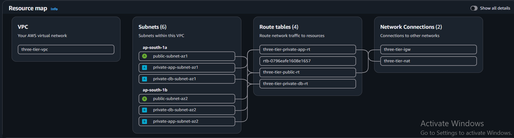

### Subnets
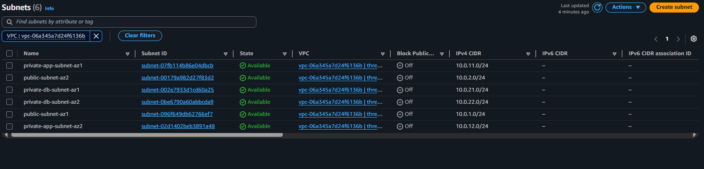

### Security Groups
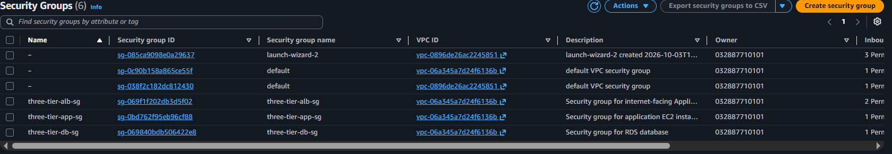

### NAT Gateway
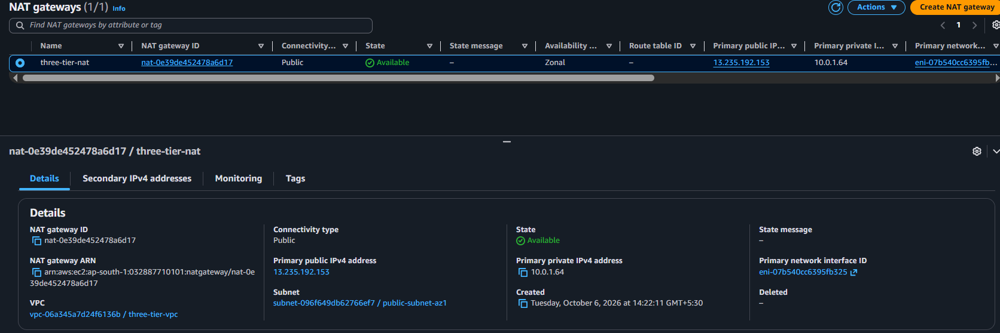

### Auto Scaling Group
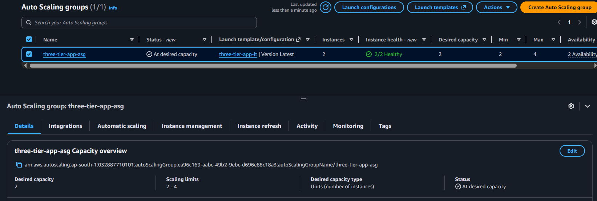

### Auto Scaling Activity / Scale-out and Scale-in
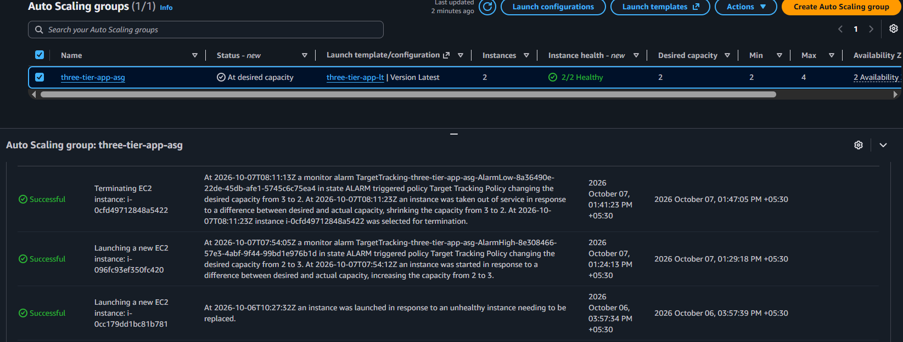

### Target Group Health
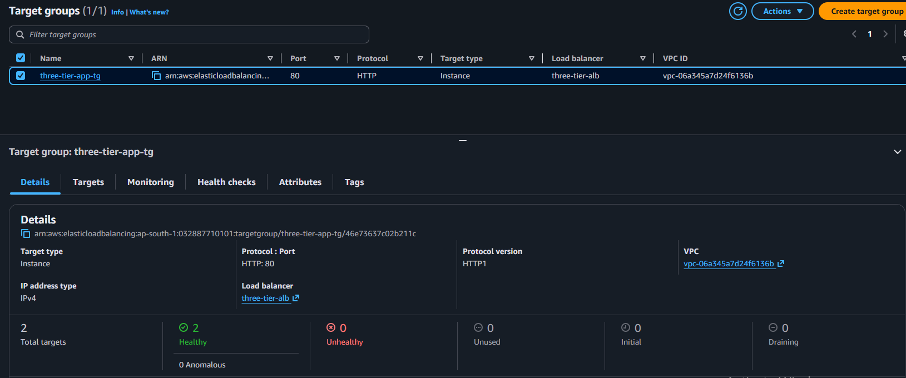

### Application Load Balancer
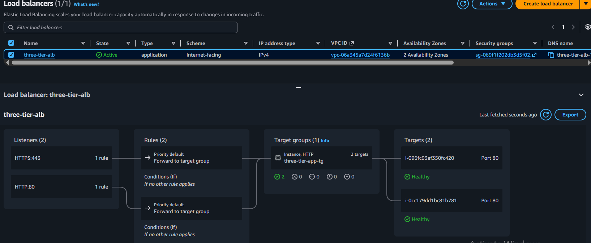

### ACM / HTTPS
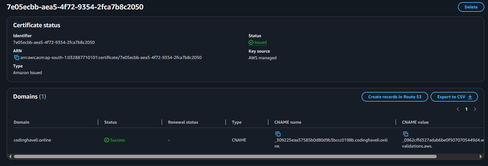

### Route 53
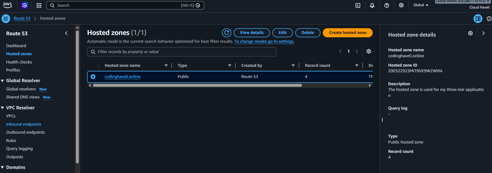

### Amazon RDS
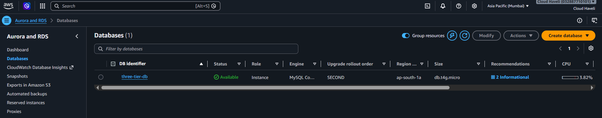

### CloudWatch / SNS
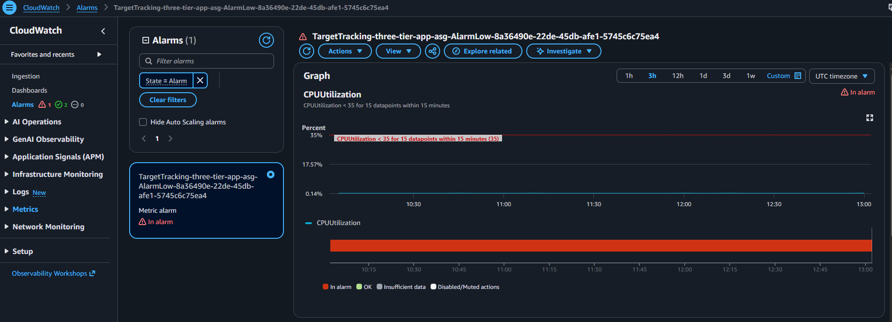

### S3 Lifecycle and Replication
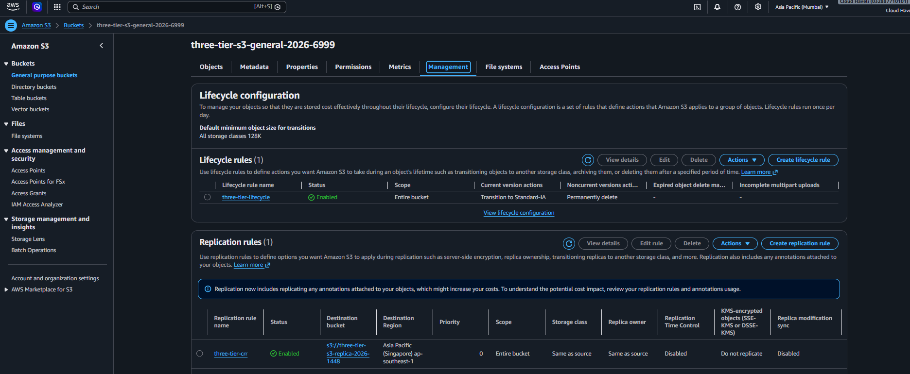

### Live HTTPS Application
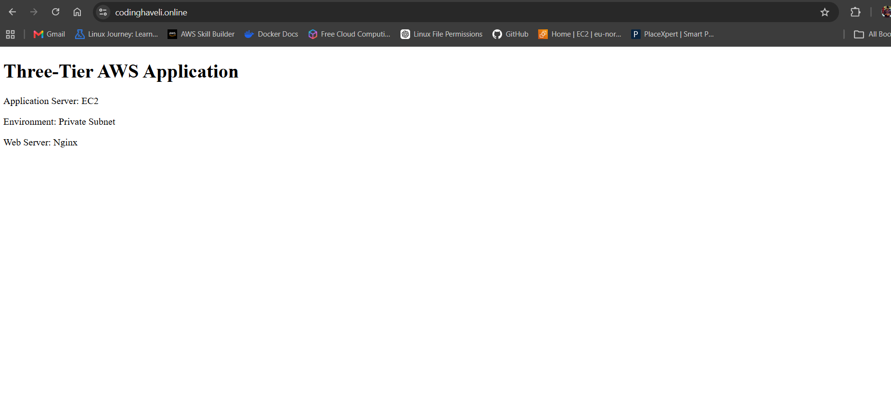

---

## 📁 Repository Structure

```text
three-tier-aws-project/
│
├── README.md
├── .gitignore
│
├── architecture/
│   └── three-tier-architecture.png
│
├── screenshots/
│   ├── VPC-RoadMap.PNG
│   ├── Subnet6.PNG
│   ├── Security-Group.PNG
│   ├── 05-nat-gateway.PNG
│   ├── 06-auto-scaling-group.PNG
│   ├── 07-asg-scale.PNG
│   ├── 08-target-group-healthy.PNG
│   ├── 09-alb.PNG
│   ├── 10-https-acm.PNG
│   ├── 11-route53.PNG
│   ├── 12-rds.PNG
│   ├── 14-cloudwatch-sns.PNG
│   ├── 15-s3-versioning-lifecycle.PNG
│   └── 18application-https.PNG
│
├── cli/
│   └── aws-cli-commands.md
│
└── docs/
    ├── architecture.md
    ├── deployment.md
    └── troubleshooting.md
```

---

## 💰 Cost Management

This project was built as a hands-on learning environment. After completing the implementation and capturing evidence, unused billable resources should be terminated to avoid unnecessary AWS charges.

Important resources to review before cleanup:

- RDS instance
- NAT Gateway
- Elastic IP
- Application Load Balancer
- EC2 instances / Auto Scaling Group
- EBS volumes
- S3 buckets and replication
- CloudWatch resources
- Route 53 hosted zone
- Other resources created specifically for the lab

---

## 🎓 Key Learning Outcomes

This project provided practical experience with:

- VPC design and subnetting
- Public vs private networking
- Route tables, IGW and NAT Gateway
- Security-group chaining
- ALB and target-group health checks
- EC2 and Launch Templates
- Auto Scaling and self-healing
- RDS private database architecture
- Route 53 DNS
- HTTPS and ACM
- CloudWatch and SNS alerting
- S3 lifecycle management
- S3 Cross-Region Replication
- IAM and Systems Manager
- AWS CLI
- Troubleshooting real AWS deployment issues

---

## 👨‍💻 Author

**Krushna Suradkar**

AWS / Cloud & DevOps Learner
